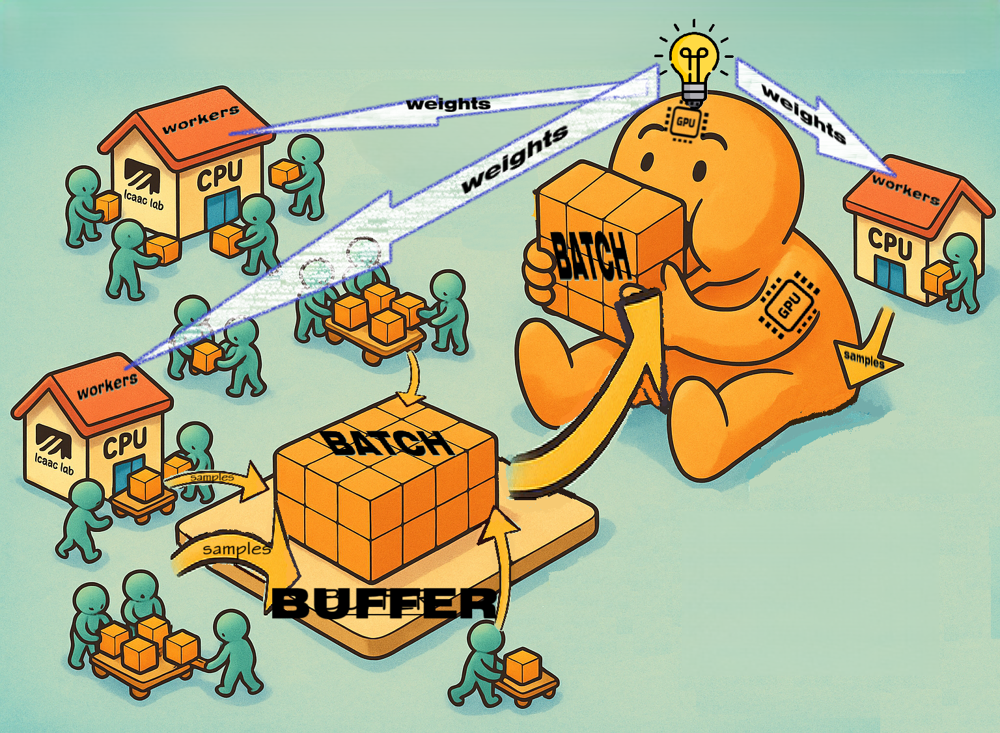

# isaac_hydra_ext

Extensions for **Isaac Lab 4.5** (NVIDIA Isaac Sim) with APPO training and demo for the **Unitree Go1** velocity task.


---

A Hydra extension and lightweight runner that connects my training algorithm (APPO/PPO) to NVIDIA **Isaac Sim / Isaac Lab** as an external add-on.  
It lets you launch training via Hydra configs without modifying the trainer.

---

## APPO at a glance



**Architecture (what runs where):**

- **Main process (GPU)** — holds the **Policy (Actor)** and **Critic**, does optimization and logging.
- **Workers (CPU)** — `W = num_workers` independent OS processes.  
  Each worker launches its own headless **Isaac-Lab** vectorized environment with `B = envs_per_worker` envs.
- **Rollout Buffer (CPU↔GPU boundary)** — a shared “place” where workers drop trajectories and the GPU reads mini-batches.

**Data flow:**

1. Each worker (CPU) collects `T = steps_per_env` steps from **each** of its `B` envs → pushes trajectories to the **Buffer**.
2. The **Main (GPU)** pulls mini-batches from the Buffer and runs several SGD passes to update the Policy/Critic.
3. The Main **broadcasts updated weights** back to **every** worker.  
   Workers do **not** talk to each other; each only talks to the Main/Buffer.

**Sizes per learning iteration:**

- Samples produced per worker: `B × T`.
- Total rollout size (buffer):  
  `N_buffer = W × B × T` (number of time–env samples in the Buffer).
- Mini-batching on the GPU:
  - `batch_size = M` (from config)
  - `num_minibatches_per_epoch = ceil(N_buffer / M)`
  - `total_gradient_steps_per_iteration = update_epochs × num_minibatches_per_epoch`

### Key knobs (from your config)

```yaml
# Collected on CPU by workers
steps_per_env: 24        # T, steps per environment before each policy update
num_workers: 4           # W, how many CPU worker processes
envs_per_worker: 64      # B, vectorized envs per worker

# Applied on GPU by the main process
update_epochs: 10         # how many passes over the same Buffer per iteration
batch_size: 512           # SGD minibatch size for the Policy/Critic updates
```

**Intuition:**

- Increase **T** (steps_per_env) → longer rollouts, better advantage estimates, but the policy is “older” by the end of collection.
- Increase **W** or **B** → bigger `N_buffer` per iteration (more data, more stable gradients, more VRAM/CPU needed).
- Increase **batch_size** → fewer optimizer steps per epoch but smoother gradients.
- Increase **update_epochs** → squeeze more learning signal out of the same data; watch KL to avoid over-fitting on on-policy data.

---

## Features

- **Hydra plugin** that registers this repo’s `conf/` as a config search path.
- **Runner** (`isaac_hydra_ext.appo_runner`) that loads your env/agent configs and starts training (APPO/PPO).
- Configs organized under `conf/` (`env/`, `ppo/`, `logging/`, `checkpoint/`, `experiment/`).
- Installable as an editable package (`pip install -e .`) on host or inside Isaac-Sim container.

---

## Requirements

- **Isaac Sim / Isaac Lab 4.5** (Ubuntu 20.04/22.04, CUDA‑capable GPU)
- Python 3.10 (Isaac Lab ships a ready environment)
- Access to Nucleus server for robot/scene assets

---

## Installation (local)

```bash
git clone https://github.com/<you>/isaac_hydra_ext.git
cd isaac_hydra_ext
python -m venv .venv && source .venv/bin/activate
pip install -e .
```

Quick smoke test:

```bash
python -m isaac_hydra_ext.appo_runner env=isaac_go1_nav experiment.name=local_test
```

> If Hydra can’t find configs, ensure the package is actually installed (`pip show isaac-hydra-ext`)—the search-path plugin is registered via entry points on install.

---

## Using inside an Isaac-Sim container

1) **Start** your Isaac-Sim container (example, adjust to your setup):

```bash
docker run --name isaac-sim --rm -it   --gpus all --runtime=nvidia --network=host   -e ACCEPT_EULA=Y -e PRIVACY_CONSENT=Y   -v ~/docker/isaac-sim/documents:/root/Documents:rw   nvcr.io/nvidia/isaac-sim:5.0.0 bash
```

2) **Install this extension** inside the container:

```bash
apt-get update && apt-get install -y git
git clone https://github.com/<you>/isaac_hydra_ext.git /root/isaac_hydra_ext
pip install -e /root/isaac_hydra_ext
```

3) **Run training**:

```bash
./isaaclab.sh -p -m isaac_hydra_ext.scripts.reinforcement_learning.appo.train \
 --task Isaac-Velocity-Sber-Unitree-Go1-v0 --num_envs 1 --headless 
```
---

## Configuration


### Examples


---

## Project layout

```
isaac_hydra_ext/
├─ README.md
├─ pyproject.toml / setup.cfg             # package metadata (pip install -e .)
├─ isaac_hydra_ext/
   ├─ scripts/
   │  └─ reinforcement_learning/
   │     └─ appo/
   │        ├─ train.py                   # entry point: isaac_hydra_ext.scripts.reinforcement_learning.appo.train
   │        ├─ test.py                    # entry point: isaac_hydra_ext.scripts.reinforcement_learning.appo.test
   │        ├─ cli_args.py                # cli utils
   │        └─ runners/
   │           └─ on_policy_runner.py     # appo runner logic
   └─ source/
      └─ isaaclab_tasks/
         └─ manager_based/
            └─ locomotion/
               └─ velocity/
                  ├─ config/
                  │  └─ go1/
                  │     ├─ __init__.py               # registers tasks: Isaac‑Velocity‑Sber‑Unitree‑Go1‑v0 / Play‑v0
                  │     ├─ agents/
                  │     │  └─  appo_cfg.yaml         
                  │     ├─ env_scene/
                  │     │  ├─ __init__.py
                  │     │  ├─ commands.py        
                  │     │  ├─ commands_cfg.py 
                  │     │  ├─ curriculum_cfg.py       
                  │     │  ├─ events_cfg.py             
                  │     │  ├─ events.py             
                  │     │  ├─ objects.py             
                  │     │  ├─ observations_cfg.py             
                  │     │  ├─ scene.py             
                  │     │  ├─ rewards.py             
                  │     │  └─ termination_cfg.py             
                  │     └─ rough_env_cfg.py          
                  └─ velocity_env_cfg.py
                     └─ registrations.py             

```

## Where are APPO parameters?

**File:** `isaac_hydra_ext/scripts/reinforcement_learning/appo/configs/appo.yaml`

Contains the main hyperparameters:
- `lr`, `entropy_coef`, `clip_eps_*`, `kl_treshold`
- `gamma`, `lam`
- `update_epochs`, `batch_size`, `steps_per_env`
- `num_workers`, `envs_per_worker`

(If your copy stores them elsewhere, check the `configs/` folder next to `train.py`.)

---

<video controls width="720" poster="assets/poster.jpg">
  <source src="assets/demo.mp4" type="video/mp4">
  Your browser does not support the video tag.
</video>

## USING APPO LIB
## APPO TRAINING
Run **from the Isaac Lab install folder** (**ISAACLAB_ROOT**), so the launcher uses the correct environment.

```bash
cd /path/to/ISAACLAB_ROOT

./isaaclab.sh -p -m isaac_hydra_ext.scripts.reinforcement_learning.appo.train \
  --task Isaac-Velocity-Sber-Unitree-Go1-v0 \
  --num_envs 1 \
  --headless
```

Flags:
- `-p` — use Isaac Lab python env.
- `-m <module>` — Python module with the entry point (`train.py`).
- `--task` — registered task name.
- `--num_envs` — number of envs on this process (increase to speed up training).
- `--headless` — disable GUI rendering (faster).
- `--resume` — continue training from the last checkpoint.

Logs / checkpoints go to the logger’s directory configured in `appo.yaml` (e.g., `logs/ppo_run/`).

---

## APPO TEST 

Also run from **ISAACLAB_ROOT**:

```bash
cd /path/to/ISAACLAB_ROOT

./isaaclab.sh -p -m isaac_hydra_ext.scripts.reinforcement_learning.appo.test \
  --task Isaac-Velocity-Sber-Unitree-Go1-Play-v0 \
  --rendering_mode performance
```
---

## USING RSL_RL LIB
## RSL_RL TRAINING

```bash
cd /path/to/ISAACLAB_ROOT

./isaaclab.sh -p -m\
isaac_hydra_ext.scripts.run_train_with_ext \
--task Isaac-Velocity-Sber-Unitree-Go1-v0   \
--num_envs 256 \
--headless
```

## RSL_RL TEST 
```bash
cd /path/to/ISAACLAB_ROOT

./isaaclab.sh -p -m\
isaac_hydra_ext.scripts.run_play_with_ext \
--task Isaac-Velocity-Sber-Unitree-Go1-Play-v0   \
--num_envs 1 \
--enable_cameras \
--checkpoint ./logs/rsl_rl/unitree_go1_rough/2025-09-23_22-02-58/model_10100.pt \
--rendering_mode performance
```

## License

MIT (see `LICENSE`).
